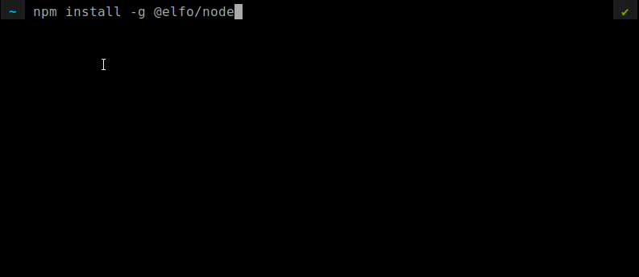

# Elfo Node CLI
Nodes on elfo protocol can earn fees by monitoring and triggering payments.

# Usage
<!-- usage -->
```sh-session
$ npm install -g @elfo/node
$ elfo COMMAND
running command...
$ elfo (--version)
0.1.0
$ elfo --help [COMMAND]
USAGE
  $ elfo COMMAND
...
```

<!-- usagestop -->
# Commands
<!-- commands -->
* [`elfo config`](#elfo-config)
* [`elfo register`](#elfo-register)
* [`elfo monitor`](#elfo-monitor)

## `elfo config`

configure elfo node

```
USAGE
  $ elfo config

DESCRIPTION
  configure elfo node

EXAMPLES
  $ elfo config
```


## `elfo register`

register elfo node

```
USAGE
  $ elfo register [-f]

FLAGS
  -f, --force  force re-register

DESCRIPTION
  register elfo node

EXAMPLES
  $ elfo register

  $ elfo register --force
```


## `elfo monitor`

monitor subscription plans and trigger payments

```
USAGE
  $ elfo monitor [-l <value>] [-s <value>]

FLAGS
  -l, --list=<value>    a txt file with a list of subscription plan account public keys
  -s, --single=<value>  a subscription plan account public key

DESCRIPTION
  monitor a list of subscription plans and trigger payments

EXAMPLES
  $ elfo monitor --list ~/subscriptin-plans-to-monitor.txt

  $ elfo monitor --single BJwb4SgNxDL9se5ZzZJ58ub9Adcj2XNfRs8GgVXKybyu

  $ elfo monitor
```

<!-- commandsstop -->