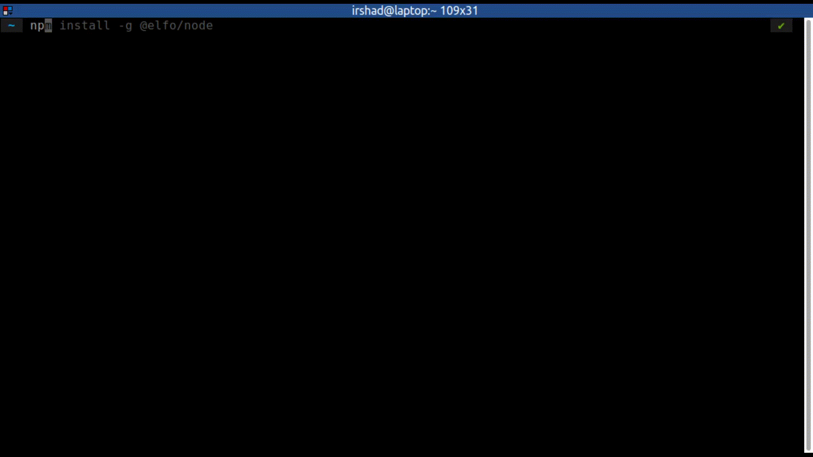
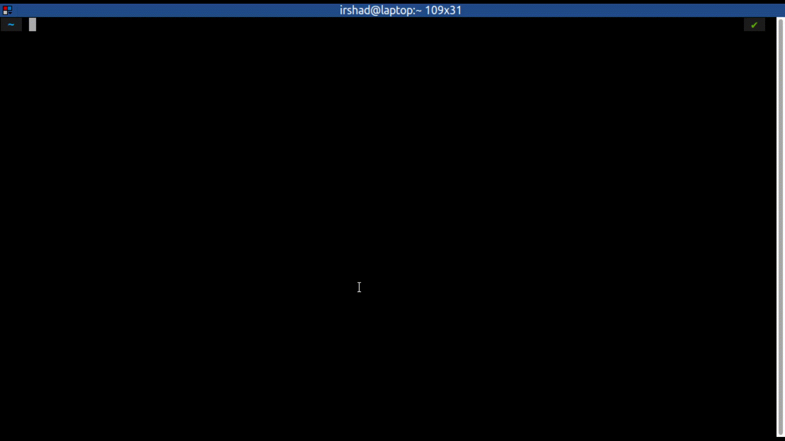
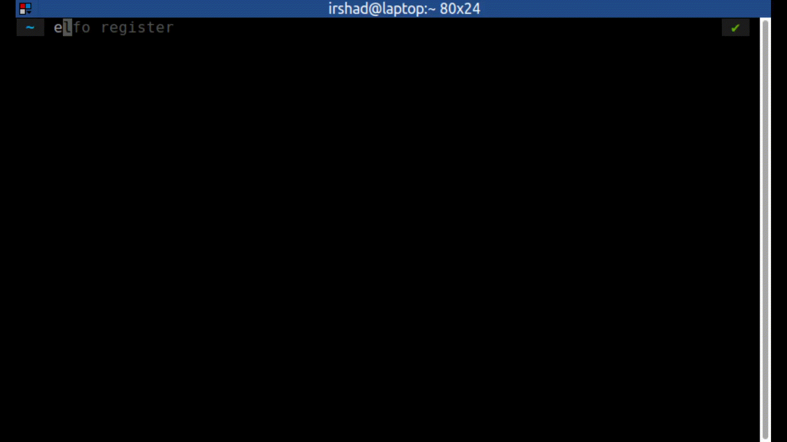
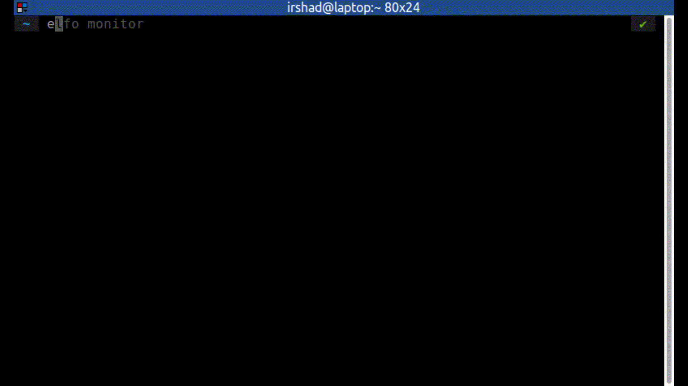

<div align="center">
  

  <h1>Elfo Protocol</h1>

  <p>
    <strong>Protocol for Subscription Payments on Solana</strong>
  </p>

  <p>
    <a href="https://github.com/elfo-protocol/elfo-sdk"></a>
    <a href="https://discord.gg/QT3WgFrC"></a>
    <a href="https://opensource.org/licenses/Apache-2.0"></a>
  </p>
</div>

Elfo Protocol enables subscription payment on Solana blockchain.

The protocol consists of three main componenets.

### Core program (smart contract)
[[github.com/elfo-protocol/elfo-core](https://github.com/elfo-protocol/elfo-core)]

### Elfo node CLI
[This Repository]

### Elfo Javascript SDK
[[github.com/elfo-protocol/elfo-sdk](https://github.com/elfo-protocol/elfo-sdk)]

---
# Elfo node CLI
A cli to register nodes to elfo-protocol. Registered nodes will be able to monitor subscriptions and trigger payments. 

For every successful payment trigger, nodes will earn fees. 

## Usage
<!-- usage -->
```sh-session
$ npm install -g @elfo/node
$ elfo COMMAND
running command...
$ elfo (--version)
@elfo/node/0.0.6 linux-x64 node-v16.14.0
$ elfo --help [COMMAND]
USAGE
  $ elfo COMMAND
...
```

<!-- usagestop -->
## Commands
<!-- commands -->
* [`elfo config`](#elfo-config)
* [`elfo register`](#elfo-register)
* [`elfo monitor`](#elfo-monitor)

## `elfo config`

configure subrina node

```
USAGE
  $ elfo config

DESCRIPTION
  configure subrina node

EXAMPLES
  $ elfo config
```

_See code: [dist/commands/config.ts](https://github.com/elfo-protocol/elfo-node/blob/v0.0.6/dist/commands/config.ts)_

## `elfo register`

register subrina node

```
USAGE
  $ elfo register [-f]

FLAGS
  -f, --force  force re-register

DESCRIPTION
  register subrina node

EXAMPLES
  $ elfo register

  $ elfo register --force
```

_See code: [dist/commands/register.ts](https://github.com/elfo-protocol/elfo-node/blob/v0.0.6/dist/commands/register.ts)_

## `elfo monitor`

monitor subscription plans and trigger payments

```
USAGE
  $ elfo monitor [-l <value>] [-s <value>]

FLAGS
  -l, --list=<value>    a txt file with a list of subscription plan account public keys
  -s, --single=<value>  a subscription plan account public key

DESCRIPTION
  monitor subscription plans and trigger payments

EXAMPLES
  $ elfo monitor --list ~/subscriptin-plans-to-monitor.txt

  $ elfo monitor --single BJwb4SgNxDL9se5ZzZJ58ub9Adcj2XNfRs8GgVXKybyu

  $ elfo monitor
```

_See code: [dist/commands/monitor.ts](https://github.com/elfo-protocol/elfo-node/blob/v0.0.6/dist/commands/monitor.ts)_

<!-- commandsstop -->
